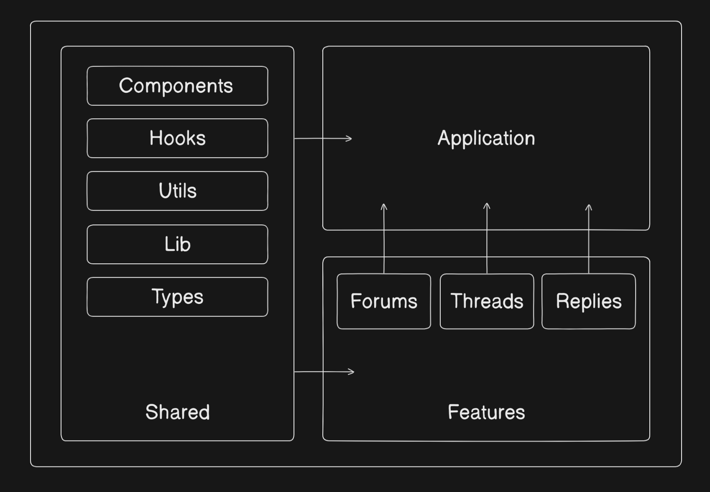

# rnForums

RN Forums is a modern, community-driven forum application built with React, TypeScript, and Vite. It provides a platform for users to connect, share, and engage in discussions on various topics.

## Features

- **Authentication**: Sign up, log in, and log out securely using Supabase.
- **Forums**: Explore and join discussions in categorized forums.
- **Threads**: Create and participate in threads within forums.
- **Replies**: Engage in conversations by replying to threads.
- **Pagination**: Infinite scrolling for threads.
- **Theme Support**: Toggle between light and dark themes.

## Tech Stack

- **Frontend**: React, TypeScript, Tailwind CSS
- **State Management**: TanStack Query
- **Routing**: TanStack Router
- **Backend**: Supabase (Database and Authentication)
- **Build Tool**: Vite

## Folder Structure

```
src/
├── app/                # Application entry and routing
├── components/         # Reusable UI components
├── context/            # Context providers for global state
├── features/           # Feature-specific modules (auth, forums, threads, replies)
├── hooks/              # Custom React hooks
├── lib/                # Library utilities (e.g., API client)
├── types/              # TypeScript type definitions
├── utils/              # Utility functions
├── index.css           # Global styles
├── main.tsx            # Application entry point
```

## Project Architecture



### Key Modules

- **Shared**: Contains reusable components, hooks, utilities, libraries, and type definitions.
- **Features**: Encapsulates feature-specific logic and components, such as forums, threads, and replies.
- **Application**: Manages the overall application structure and routing.

## Project Demo

Check out the project demo on YouTube: [rnForums Demo](https://www.youtube.com/watch?v=QOfLTJjUSyI)

## Acknowledgments

- [React](https://reactjs.org/)
- [Vite](https://vitejs.dev/)
- [Supabase](https://supabase.io/)
- [Tailwind CSS](https://tailwindcss.com/)
- [TanStack Router](https://tanstack.com/router)
- [TanStack Query](https://tanstack.com/query)
